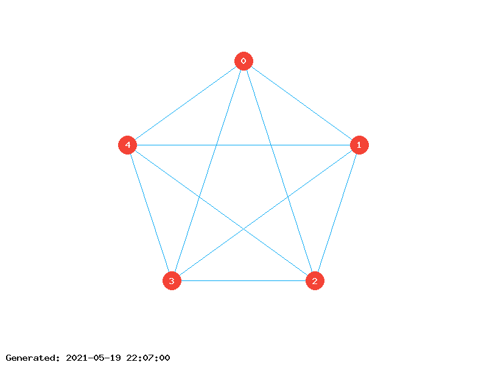

# GraphDraw

This is a part of the project for Graphs Theory.

[](https://wakatime.com/badge/github/sokoloowski/GraphDraw)
[](https://www.php.net/)
[](https://www.php.net/manual/en/book.image.php)

## Usage

### Adjacency list in file

```powershell
PS D:\GraphDraw> php index.php example.json

# or

PS D:\GraphDraw> php index.php
> example.json
```

### Adjacency list directly as user input

```powershell
PS D:\GraphDraw> php index.php "[[2, 3], [0, 2, 3, 4], [1, 3, 4], [0, 4], [0]]"

# or

PS D:\GraphDraw> php index.php
> [[2, 3], [0, 2, 3, 4], [1, 3, 4], [0, 4], [0]]
```

## Input

Script takes JSON formatted adjacency list only!

## Output

Script is generating PNG image called `graph.png`, in the same directory, where `index.php` is located. Additionaly, incidence matrix is generated and displayed in console.

## Example

List `[[2, 3], [0, 2, 3, 4], [1, 3, 4], [0, 4], [0]]` will generate the following output:

```
Graph visualisation is saved to D:\GraphDraw\output\graph.png

incidence matrix:
        | 1  2  3  4  5  6  7  8  9  10
--------+-------------------------------
1       | 1  1  1  0  0  0  0  0  0  1
2       | 0  0  1  1  1  1  0  0  0  0
3       | 1  0  0  1  0  0  1  1  0  0
4       | 0  1  0  0  1  0  1  0  1  0
5       | 0  0  0  0  0  1  0  1  1  1
```

## Generated graph visualisation:


